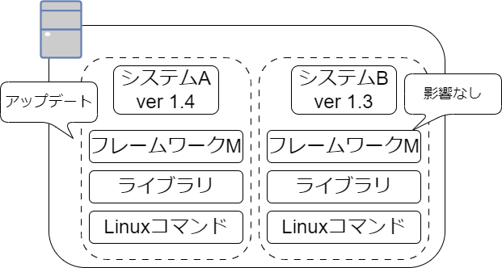
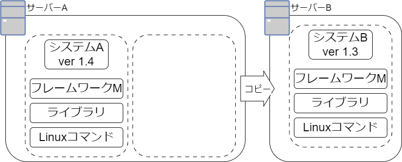
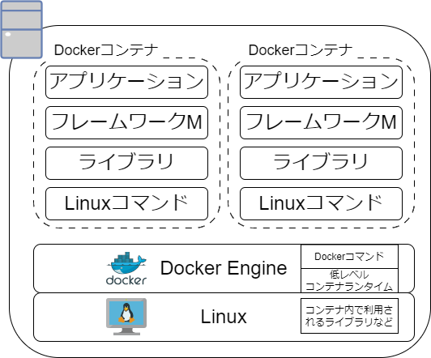
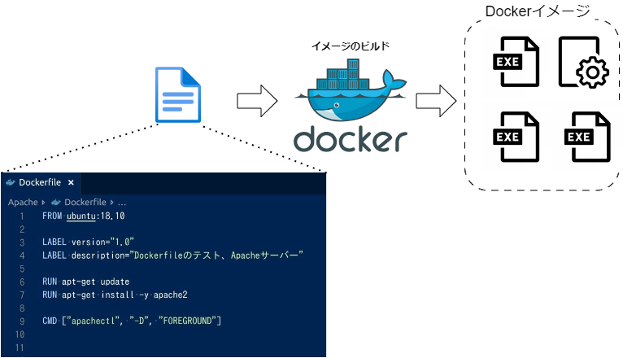
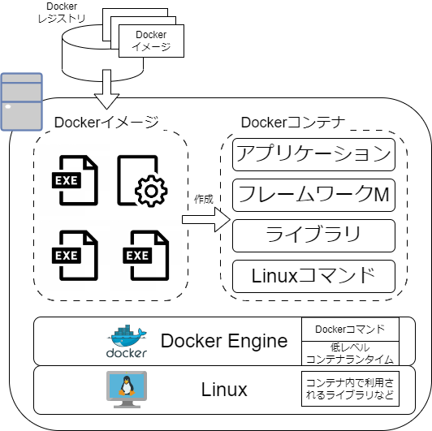

# B3勉強会：仮想化技術（コンテナ）

## コンテナの仕組み

### コンテナとは

コンテナとは，互いに影響しない隔離された実行環境を提供する技術で，コンテナ内にアプリケーションを実行するために必要な設定ファイル，ライブラリ，コマンドなどが含まれ独立している．
そのため，サーバ内に複数のシステムを同居させても競合問題が起きない．
例えば，フレームワークのバージョンが異なるシステムを同じサーバ内にインストールした際などの，ライブラリをインストールするディレクトリの競合を防ぐことができる．



また，コンテナは独立していることによりポータビリティ性があり，サーバAで動かしていたコンテナをサーバBに移動移動することができる．



### コンテナの実行基盤

コンテナを実現するソフトウェアにDockerがある．
LinuxやWindowsなどにDocker EngineをインストールすることでDockerのコンテナを実行できるようになる．
Docker Engine内にはコンテナを操作するためのコマンドやコンテナを外部と隔離するための低レベルコンテナランタイムがあり，ユーザはDockerコマンドを実行し，Docker Engineが低レベルコンテナを作成することで新たなコンテナを作成できる．



### コンテナの元となるDockerイメージ

コンテナはそれぞれ独立した実行環境のため，コンテナを作るためにはライブラリやフレームワーク，基本コマンドなどを事前に用意する必要がある．
1からこれらの必要なものをすべて用意したコンテナを作成することは困難であるため，Dockerfileと呼ばれるテキストファイルからDockerイメージを作成できる．



作成したコンテナイメージはDocker Hubなどのコンテナレジストリに登録することができ，他のPCはコンテナレジストリに登録されたDockerイメージをダウンロードして利用することができる．



## Dockerチュートリアル

### Docker Engineのインストール

[Docker Engineのインストール](https://docs.docker.com/engine/install/ubuntu/)

```bash
$ sudo gpasswd -a <user> docker

$ Ctrl + D

$ cat /etc/group | grep docker
```

### Dockerハンズオン

Nginxコンテナを起動してみる．

1. Nginxのコンテナイメージのダウンロード
1. コンテナを起動
1. Nginxにアクセス
1. コンテナの停止と再開
1. コンテナの破棄
1. コンテナイメージの破棄

#### Nginxのコンテナイメージのダウンロード

[Docker Hub](https://hub.docker.com/_/nginx)にアクセスし，Nginxのコンテナイメージを検索し，コンテナイメージのダウンロード

```bash
# `docker pull [OPTIONS] NAME[:TAG|@DIGEST]`でコンテナイメージのダウンロード
# nginxの最新のコンテナイメージをダウンロード
# https://docs.docker.com/engine/reference/commandline/pull/#docker-pull
$ docker pull nginx:latest

# `docker image ls [OPTIONS] [REPOSITORY[:TAG]]`でDocker imageを一覧表示
# ダウンロードしたnginxのコンテナイメージを確認
# https://docs.docker.com/engine/reference/commandline/image_ls/#docker-image-ls
$ docker image ls nginx:latest
REPOSITORY                         TAG       IMAGE ID       CREATED         SIZE
nginx                              latest    a6bd71f48f68   12 days ago     187MB
```

#### コンテナを起動

```bash
# `docker ps [OPTIONS]`でコンテナの一覧表示
# https://docs.docker.com/engine/reference/commandline/ps/#docker-ps
$ docker ps
CONTAINER ID   IMAGE     COMMAND   CREATED   STATUS    PORTS     NAMES

# `docker run [OPTIONS] IMAGE[:TAG|@DIGEST] [COMMAND] [ARG...]`でコンテナの起動
# コンテナを起動する際，
# https://docs.docker.com/engine/reference/run/#docker-run-reference
$ docker run -dit --name my-nginx -p 8080:80 nginx
5a9bb3f59a33b9b600bf3ba779895de159179fd17c8be28486abb9b897910669

# nginxコンテナが作成されていることがわかる
$ docker ps
CONTAINER ID   IMAGE     COMMAND                  CREATED         STATUS         PORTS                                   NAMES
5a9bb3f59a33   nginx     "/docker-entrypoint.…"   4 seconds ago   Up 3 seconds   0.0.0.0:8080->80/tcp, :::8080->80/tcp   my-nginx
```

#### Nginxにアクセス

```bash
# `curl`を用いてコンテナ内のnginxにリクエストを送信
$ curl http://localhost:8080
<!DOCTYPE html>
<html>
<head>
<title>Welcome to nginx!</title>
<style>
html { color-scheme: light dark; }
body { width: 35em; margin: 0 auto;
font-family: Tahoma, Verdana, Arial, sans-serif; }
</style>
</head>
<body>
<h1>Welcome to nginx!</h1>
<p>If you see this page, the nginx web server is successfully installed and
working. Further configuration is required.</p>

<p>For online documentation and support please refer to
<a href="http://nginx.org/">nginx.org</a>.<br/>
Commercial support is available at
<a href="http://nginx.com/">nginx.com</a>.</p>

<p><em>Thank you for using nginx.</em></p>
</body>
</html>

# `docker logs [OPTIONS] CONTAINER`で
$ docker logs my-nginx
-- snip --
172.17.0.1 - - [04/Dec/2023:06:05:47 +0000] "GET / HTTP/1.1" 200 615 "-" "curl/7.81.0" "-"
```

#### コンテナの停止と再開

```bash
# `docker stop <container name or id>`でコンテナを停止
$ docker stop my-nginx
my-nginx

# -aオプションを用いることにより，停止しているコンテナも表示
# コンテナを停止したことによりSTATUSの値がExitedになっていることがわかる
$ docker ps -a
CONTAINER ID   IMAGE     COMMAND                  CREATED         STATUS                     PORTS     NAMES
5a9bb3f59a33   nginx     "/docker-entrypoint.…"   4 minutes ago   Exited (0) 3 seconds ago             my-nginx

$ docker start my-nginx
my-nginx

# コンテナを再開したことによりSTATUSの値がUpになっていることがわかる
$ docker ps
CONTAINER ID   IMAGE     COMMAND                  CREATED         STATUS         PORTS                                   NAMES
5a9bb3f59a33   nginx     "/docker-entrypoint.…"   5 minutes ago   Up 2 seconds   0.0.0.0:8080->80/tcp, :::8080->80/tcp   my-nginx
```

#### コンテナの破棄

```bash
$ docker stop my-nginx
my-nginx

$ docker rm my-nginx
my-nginx

$ docker ps -a
CONTAINER ID   IMAGE     COMMAND   CREATED   STATUS    PORTS     NAMES
```

#### コンテナイメージの破棄

```bash
$ docker image ls
REPOSITORY                         TAG       IMAGE ID       CREATED         SIZE
nginx                              latest    a6bd71f48f68   12 days ago     187MB

$ docker image rm nginx
Untagged: nginx:latest
Untagged: nginx@sha256:10d1f5b58f74683ad34eb29287e07dab1e90f10af243f151bb50aa5dbb4d62ee
Deleted: sha256:a6bd71f48f6839d9faae1f29d3babef831e76bc213107682c5cc80f0cbb30866
Deleted: sha256:fe7723b2df19ccf75328cb1f39c90c2332679144231501f3d4d00f51b16c2867
Deleted: sha256:c0f3f17b019abbcfeb0c162054786ea8087ca792a2191a79f03040a8cd98f41d
Deleted: sha256:32cfe66e62a5f36abf128703007285e1a3b9078f5b33a367df1534399065cc70
Deleted: sha256:8713bfa322a66040e882b7822dc0c110a68cfafd3bb37332fdbb9426171d7ec9
Deleted: sha256:253c039db964b57be02d9bb0f3d6916b7948687b4f6f4fc681644a419a47979d
Deleted: sha256:2c235ef4cca1fbb74e3a7aa47e654fe943bc0c2becbdd4d6af7cbf9e375fe08a
Deleted: sha256:92770f546e065c4942829b1f0d7d1f02c2eb1e6acf0d1bc08ef0bf6be4972839

$ docker image ls
REPOSITORY                         TAG       IMAGE ID       CREATED         SIZE
```

### Dockerでのコンテナのログ管理

上記で`docker logs`コマンドを用いてコンテナ内のNginxのログを確認した．
デフォルトでは，このログは，`/var/lib/docker/containers/<container_id>/<container_id>-json.log`ファイルに保存される．
しかし，このファイルはコンテナが削除される際に一緒に削除される．そのため，syslogなどを用いてログ管理する必要がある．

DockerではLogging Driverはコンテナ起動時に`--log-driver`オプションを用いて設定できる．

https://docs.docker.jp/v19.03/config/container/logging/configure.html
|ドライバ|説明|
|----|----|
|none|コンテナに対するログを記録せず、 docker logs は何も出力しません。|
|local|ログは最小のオーバヘッドになるよう設計された、カスタム形式で記録します。|
|json-file|JSON 形式でログを記録します。Docker のデフォルトのロギング・ドライバです。|
|syslog|syslog ファシリティに対してロギング・メッセージを記録します。ホスト・マシン上で syslog デーモンの起動が必要です。|
|journald|ログメッセージを journald に記録します。ホスト・マシン上で journald デーモンの起動が必要です。|
|gelf|ログメッセージを Graylog または Logstach などのような Graylog Extended Log Format (GELF) エンドポイントに記録します。|
|fluentd|ログメッセージを fluentd に記録（forward input）します。ホスト・マシン上で fluentd デーモンの起動が必要です。|
|awslogs|ログメッセージを Amazon CloudWatch Logs に記録します。|
|splunk|HTTP Event Collector を使い、 splunk にログメッセージを記録します。|
|etwlogs|Event Tracing for Windows (ETW) events としてログメッセージを記録します。Windows プラットフォーム上で利用可能です。|
|gcplogs|Google Cloud Platform (GCP) ロギングにログメッセージを記録します。|
|logentries|Rapid7 Logentries に対してログメッセージを記録します。|

```bash
# --rmオプションはコンテナ停止時に削除も同時にするオプション
$ docker run --rm -dit --name my-nginx -p 8080:80  --log-driver=syslog nginx

$ cat /var/log/syslog
Dec  8 08:35:36 usagi 2d9b3e9bae00[243964]: 192.168.0.100 - - [07/Dec/2023:23:35:36 +0000] "GET / HTTP/1.1" 200 615 "-" "Mozilla/5.0 (Windows NT 10.0; Win64; x64) AppleWebKit/537.36 (KHTML, like Gecko) Chrome/119.0.0.0 Safari/537.36" "-"#015
Dec  8 08:35:36 usagi 2d9b3e9bae00[243964]: 2023/12/07 23:35:36 [error] 29#29: *8 open() "/usr/share/nginx/html/favicon.ico" failed (2: No such file or directory), client: 192.168.0.100, server: localhost, request: "GET /favicon.ico HTTP/1.1", host: "192.168.0.104:8080", referrer: "http://192.168.0.104:8080/"#015
Dec  8 08:35:36 usagi 2d9b3e9bae00[243964]: 192.168.0.100 - - [07/Dec/2023:23:35:36 +0000] "GET /favicon.ico HTTP/1.1" 404 555 "http://192.168.0.104:8080/" "Mozilla/5.0 (Windows NT 10.0; Win64; x64) AppleWebKit/537.36 (KHTML, like Gecko) Chrome/119.0.0.0 Safari/537.36" "-"#015
Dec  8 08:35:37 usagi tailscaled[1232]: Accept: TCP{100.91.195.94:60058 > 100.109.47.8:22} 40 tcp non-syn

$ docker stop my-nginx
```

Dockerはコンテナ内のアプリケーションの標準出力，標準エラーをログとして保存している．
そのため，コンテナを用いてアプリケーションを作成する際は，ログを標準出力，標準エラーに吐き出し，Logging Driverでログの保存場所を変更するのが良い．


### ボリューム管理

コンテナは消えると内部のデータも削除するため，コンテナ内ではデータを持つべきではなく，ホスト上のストレージやストレージサーバを用いるのが良い．
外部にデータをもたせる方法として，バインドマウント，ボリュームマウントがある．
バインドマウントはホスト上のディレクトリをコンテナ上のディレクトリにマウントし，ボリュームマウントはDocker Engine上で確保した領域をマウントする方法である．

-  バインドマウント
```bash
# htmlディレクトリを`/usr/share/nginx/html`ディレクトリにバインドマウント
$ docker run \
--rm \
-dit \
--name my-nginx \
-p 8080:80 \
--mount type=bind,source="$(pwd)"/html,target=/usr/share/nginx/html \
nginx

$ curl http://localhost:8080
it workd
```

- ボリュームマウント
```bash
$ docker run \
--rm \
--dit \
--name my-sql \
--mount type=volume,src=myvol,dst=/var/lib/mysql \
-e MYSQL_ROOT_PASSWORD=password \
mysql:5.7

$ docker exec -it my-sql bash

$ mysql -p

mysql> CREATE DATABASE exampledb;

mysql> CREATE TABLE exampletable (id INT NOT NULL AUTO_INCREMENT, name VARCHAR(50), PRIMARY KEY(id));

mysql> INSERT INTO exampletable (name) VALUES ('user01');

mysql> INSERT INTO exampletable (name) VALUES ('user02');

mysql> SELECT * FROM exampletable;
+----+--------+
| id | name   |
+----+--------+
|  1 | user01 |
|  2 | user02 |
+----+--------+
2 rows in set (0.00 sec)

$ docker stop my-sql

$ docker exec -it my-sql bash

$ mysql -p

mysql> SELECT * FROM exampletable;
+----+--------+
| id | name   |
+----+--------+
|  1 | user01 |
|  2 | user02 |
+----+--------+
2 rows in set (0.00 sec)
```

```bash
# ボリューム一覧表示
$ docker volume ls
-- snip --
local     myvol

# ボリュームの削除
$ docker volume rm myvol
```

### Dockerfile

Dockerfileベストプラクティス
- https://docs.docker.com/develop/develop-images/dockerfile_best-practices/

1. 1つのコンテナは1つの処理しかしない
    - 1つのコンテナ内に，データベース，WordPressなど複数のアプリケーションを入れない
1. 利用するポートを明確にする
    - コンテナと通信をする際は，-pオプションでポート番号を指定ため，どのようなポートを経由して外部から繋がれるのかを明確にする
1. 永続化するべき場所を明確にする
    - コンテナ内で置き換えるファイルを置くディレクトリを明確にして，イメージの利用者がバインドマウントやボリュームマウントをする際の手がかりにする
1. 設定は環境変数で渡す
    - 設定を渡す際は環境変数を用いるのが慣例
1. ログは標準出力に書き出す
    - 上述
1. メインのプログラムが終了するとコンテナも終了する
    - 

```Docker
# ベースイメージはnginx
FROM nginx

# ``./html/index.html`をコンテナ内の`/usr/share/nginx/html`にコピー
COPY ./html/index.html /usr/share/nginx/html
```

```bash
$ cd image_build

$ docker build -t myimage .

$ docker image ls | grep myimage
myimage                            latest    98a1fd1ec10f   8 seconds ago   187MB

$ docker run -dit --rm --name myimage_container -p 8080:80 myimage

$ curl http://localhost:8080
build success!
```

#### マルチステージビルド


```Dockerfile
# syntax=docker/dockerfile:1
FROM golang:1.18
WORKDIR /app

COPY go.mod ./
COPY go.sum ./
RUN go mod download

COPY *.go ./

RUN go build -o ./server

FROM alpine:latest
RUN apk --no-cache add ca-certificates
WORKDIR /root/
COPY --from=0 /app/server ./
CMD ["./server"]
```

```golang
package main

import (
	"net/http"

	"github.com/labstack/echo/v4"
	"github.com/labstack/echo/v4/middleware"
)

func main() {
	// Echo instance
	e := echo.New()

	// Middleware
	e.Use(middleware.Logger())
	e.Use(middleware.Recover())

	// Route => handler
	e.GET("/", func(c echo.Context) error {
		return c.String(http.StatusOK, "Hello, World!\n")
	})

	// Start server
	e.Logger.Fatal(e.Start(":1323"))
}
```

```bash
$ cd multi_stage_build
$ docker build helloworld .

```

## コンテナランタイムの仕組みと実装

