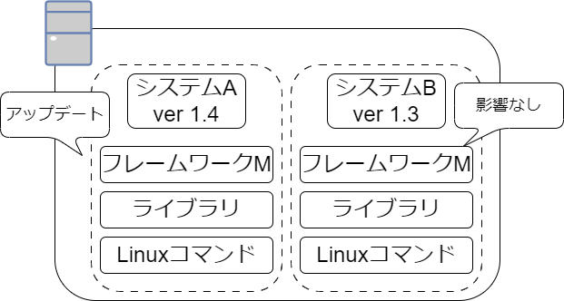

# B3勉強会：仮想化技術（コンテナ）

## コンテナの仕組み

### コンテナとは

コンテナとは，互いに影響しない隔離された実行環境を提供する技術で，コンテナ内にアプリケーションを実行するために必要な設定ファイル，ライブラリ，コマンドなどが含まれ独立している．
そのため，サーバ内に複数のシステムを同居させても競合問題が起きない．
例えば，フレームワークのバージョンが異なるシステムを同じサーバ内にインストールした際などの，ライブラリをインストールするディレクトリの競合を防ぐことができる．



また，コンテナは独立していることによりポータビリティ性があり，サーバAで動かしていたコンテナをサーバBに移動移動することができる．


### コンテナの実行基盤

コンテナを実現するソフトウェアにDockerがある．
LinuxやWindowsなどにDocker EngineをインストールすることでDockerのコンテナを実行できるようになる．
Docker Engine内にはコンテナを操作するためのコマンドやコンテナを外部と隔離するための低レベルコンテナランタイムがあり，ユーザはDockerコマンドを実行し，Docker Engineが低レベルコンテナを作成することで新たなコンテナを作成できる．


### コンテナの元となるDockerイメージ

コンテナはそれぞれ独立した実行環境のため，コンテナを作るためにはライブラリやフレームワーク，基本コマンドなどを事前に用意する必要がある．
1からこれらの必要なものをすべて用意したコンテナを作成することは困難であるため，Dockerfileと呼ばれるテキストファイルからDockerイメージを作成できる．


作成したコンテナイメージはDocker Hubなどのコンテナレジストリに登録することができ，他のPCはコンテナレジストリに登録されたDockerイメージをダウンロードして利用することができる．


## Dockerチュートリアル

### Docker Engineのインストール

[Docker Engineのインストール](https://docs.docker.com/engine/install/ubuntu/)

```bash
$ sudo gpasswd -a <user> docker

$ Ctrl + D

$ cat /etc/group | grep docker
```

### Dockerハンズオン

Nginxコンテナを起動してみる．

1. Nginxのコンテナイメージのダウンロード
1. コンテナを起動
1. Nginxにアクセス
1. コンテナの停止と再開
1. コンテナの破棄
1. コンテナイメージの破棄

#### Nginxのコンテナイメージのダウンロード

[Docker Hub](https://hub.docker.com/_/nginx)にアクセスし，Nginxのコンテナイメージを検索し，コンテナイメージのダウンロード

```bash
# `docker pull [OPTIONS] NAME[:TAG|@DIGEST]`でコンテナイメージのダウンロード
# nginxの最新のコンテナイメージをダウンロード
# https://docs.docker.com/engine/reference/commandline/pull/#docker-pull
$ docker pull nginx:latest

# `docker image ls [OPTIONS] [REPOSITORY[:TAG]]`でDocker imageを一覧表示
# ダウンロードしたnginxのコンテナイメージを確認
# https://docs.docker.com/engine/reference/commandline/image_ls/#docker-image-ls
$ docker image ls nginx:latest
REPOSITORY                         TAG       IMAGE ID       CREATED         SIZE
nginx                              latest    a6bd71f48f68   12 days ago     187MB
```

#### コンテナを起動

```bash
# `docker ps [OPTIONS]`でコンテナの一覧表示
# https://docs.docker.com/engine/reference/commandline/ps/#docker-ps
$ docker ps
CONTAINER ID   IMAGE     COMMAND   CREATED   STATUS    PORTS     NAMES

# `docker run [OPTIONS] IMAGE[:TAG|@DIGEST] [COMMAND] [ARG...]`でコンテナの起動
# コンテナを起動する際，
# https://docs.docker.com/engine/reference/run/#docker-run-reference
$ docker run -dit --name my-nginx -p 8080:80 nginx
5a9bb3f59a33b9b600bf3ba779895de159179fd17c8be28486abb9b897910669

# nginxコンテナが作成されていることがわかる
$ docker ps
CONTAINER ID   IMAGE     COMMAND                  CREATED         STATUS         PORTS                                   NAMES
5a9bb3f59a33   nginx     "/docker-entrypoint.…"   4 seconds ago   Up 3 seconds   0.0.0.0:8080->80/tcp, :::8080->80/tcp   my-nginx
```

#### Nginxにアクセス

```bash
# `curl`を用いてコンテナ内のnginxにリクエストを送信
$ curl http://localhost:8080
<!DOCTYPE html>
<html>
<head>
<title>Welcome to nginx!</title>
<style>
html { color-scheme: light dark; }
body { width: 35em; margin: 0 auto;
font-family: Tahoma, Verdana, Arial, sans-serif; }
</style>
</head>
<body>
<h1>Welcome to nginx!</h1>
<p>If you see this page, the nginx web server is successfully installed and
working. Further configuration is required.</p>

<p>For online documentation and support please refer to
<a href="http://nginx.org/">nginx.org</a>.<br/>
Commercial support is available at
<a href="http://nginx.com/">nginx.com</a>.</p>

<p><em>Thank you for using nginx.</em></p>
</body>
</html>

# `docker logs [OPTIONS] CONTAINER`で
$ docker logs my-nginx
-- snip --
172.17.0.1 - - [04/Dec/2023:06:05:47 +0000] "GET / HTTP/1.1" 200 615 "-" "curl/7.81.0" "-"
```

#### コンテナの停止と再開

```bash
# `docker stop <container name or id>`でコンテナを停止
$ docker stop my-nginx
my-nginx

# -aオプションを用いることにより，停止しているコンテナも表示
# コンテナを停止したことによりSTATUSの値がExitedになっていることがわかる
$ docker ps -a
CONTAINER ID   IMAGE     COMMAND                  CREATED         STATUS                     PORTS     NAMES
5a9bb3f59a33   nginx     "/docker-entrypoint.…"   4 minutes ago   Exited (0) 3 seconds ago             my-nginx

$ docker start my-nginx
my-nginx

# コンテナを再開したことによりSTATUSの値がUpになっていることがわかる
$ docker ps
CONTAINER ID   IMAGE     COMMAND                  CREATED         STATUS         PORTS                                   NAMES
5a9bb3f59a33   nginx     "/docker-entrypoint.…"   5 minutes ago   Up 2 seconds   0.0.0.0:8080->80/tcp, :::8080->80/tcp   my-nginx
```

#### コンテナの破棄

```bash
$ docker stop my-nginx
my-nginx

$ docker rm my-nginx
my-nginx

$ docker ps -a
CONTAINER ID   IMAGE     COMMAND   CREATED   STATUS    PORTS     NAMES
```

#### コンテナイメージの破棄

```bash
$ docker image ls
REPOSITORY                         TAG       IMAGE ID       CREATED         SIZE
nginx                              latest    a6bd71f48f68   12 days ago     187MB

$ docker image rm nginx
Untagged: nginx:latest
Untagged: nginx@sha256:10d1f5b58f74683ad34eb29287e07dab1e90f10af243f151bb50aa5dbb4d62ee
Deleted: sha256:a6bd71f48f6839d9faae1f29d3babef831e76bc213107682c5cc80f0cbb30866
Deleted: sha256:fe7723b2df19ccf75328cb1f39c90c2332679144231501f3d4d00f51b16c2867
Deleted: sha256:c0f3f17b019abbcfeb0c162054786ea8087ca792a2191a79f03040a8cd98f41d
Deleted: sha256:32cfe66e62a5f36abf128703007285e1a3b9078f5b33a367df1534399065cc70
Deleted: sha256:8713bfa322a66040e882b7822dc0c110a68cfafd3bb37332fdbb9426171d7ec9
Deleted: sha256:253c039db964b57be02d9bb0f3d6916b7948687b4f6f4fc681644a419a47979d
Deleted: sha256:2c235ef4cca1fbb74e3a7aa47e654fe943bc0c2becbdd4d6af7cbf9e375fe08a
Deleted: sha256:92770f546e065c4942829b1f0d7d1f02c2eb1e6acf0d1bc08ef0bf6be4972839

$ docker image ls
REPOSITORY                         TAG       IMAGE ID       CREATED         SIZE
```

### Dockerでのコンテナのログ管理

### ボリューム管理

### Dockerfile

## コンテナランタイムの仕組みと実装
